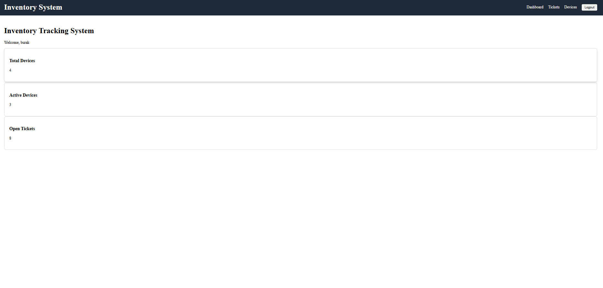
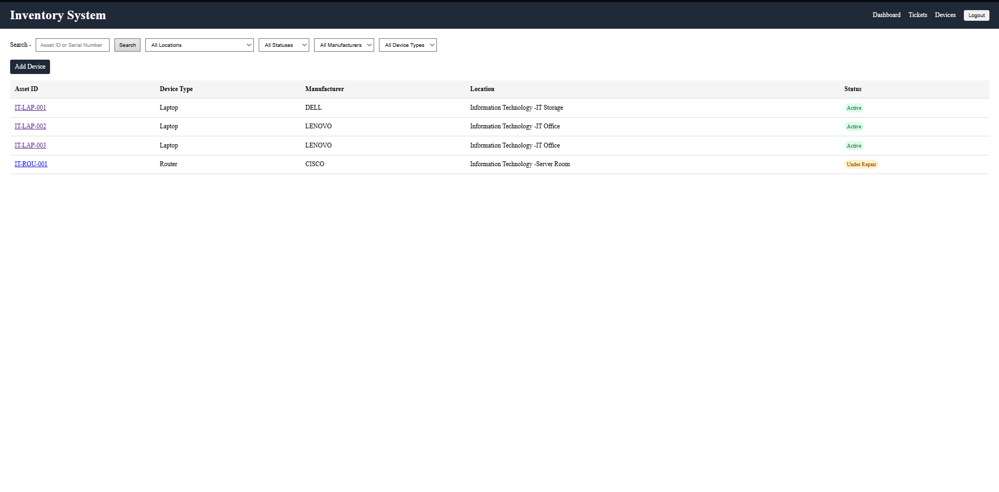
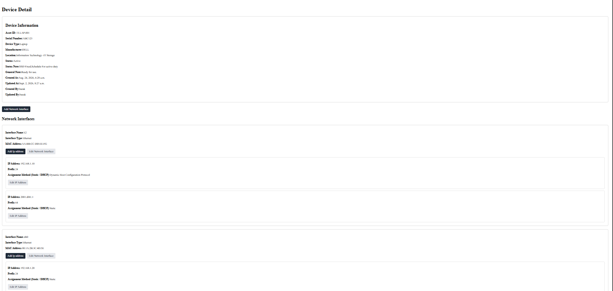
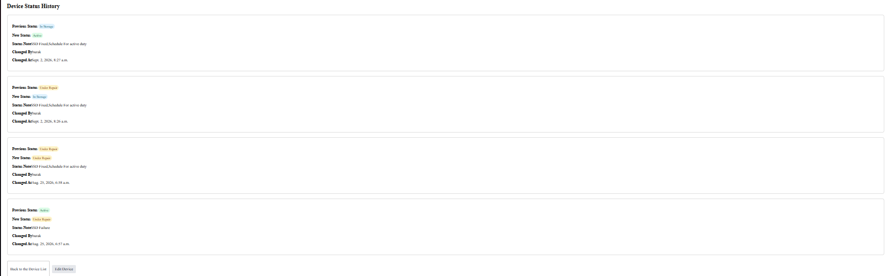
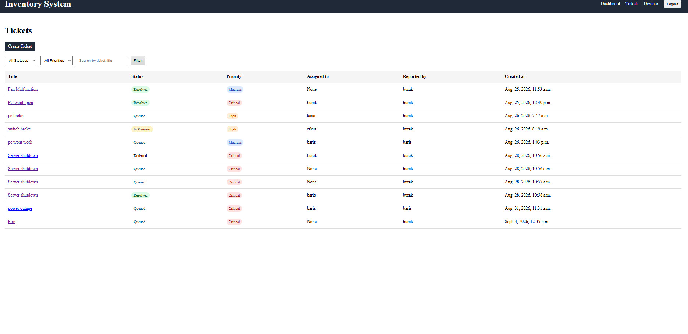

# Inventory Tracking System

A Django-based inventory and IT support management system developed during my internship.

The system provides device inventory management, network interface and IP address tracking, location-based asset organization, ticket management, role-based access control, and audit/history tracking.

## Features

- Device inventory management
- Device search and filtering by status, location, manufacturer, and device type
- Device status tracking with history records
- Network interface management for devices
- IP address management for network interfaces
- Ticket creation and IT support workflow
- Ticket filtering by title, status, and priority
- Ticket assignment and status history tracking
- Ticket comments
- Role-based access control for Admin, IT Staff, and Employee users
- Location, manufacturer, and device type reference management
- Responsive user interface for desktop and mobile screens


## User Roles

### Admin
- Full access to all system features
- Can manage users and permissions
- Can add, edit, view, and delete system records
- Can manage device types, manufacturers, departments, and locations
- Can manage tickets, devices, network interfaces, IP addresses, and history records

### IT Staff
- Can view, add, and edit devices
- Can manage network interfaces and IP addresses
- Can view device status history
- Can view and work on tickets
- Can take ownership of tickets
- Can update ticket status when permitted
- Can add ticket comments
- Can view ticket assignment and status histories
- Cannot delete protected inventory records

### Employee
- Can view devices
- Can create and view tickets
- Can view basic reference information such as locations and manufacturers
- Cannot modify devices, network interfaces, or IP addresses
- Cannot manage ticket assignment, status workflow, or internal history records


## Technologies


- **Python** - Backend programming language
- **Django** - Web framework and application structure
- **SQLite** - Development database
- **HTML / CSS** - User interface development
- **Django Templates** - Dynamic page rendering
- **Git / GitHub** - Version control and source code management


## Project Structure

```text
inventory_system/
│
├── core/
│   ├── templates/
│   ├── static/
│   └── views.py
│
├── locations/
│   ├── templates/
│   ├── admin.py
│   ├── forms.py
│   ├── models.py
│   ├── urls.py
│   └── views.py
│
├── tickets/
│   ├── management/
│   │   └── commands/
│   │       └── setup_roles.py
│   ├── templates/
│   ├── admin.py
│   ├── forms.py
│   ├── models.py
│   ├── urls.py
│   └── views.py
│
├── inventory_system/
│   ├── settings.py
│   └── urls.py
│
├── manage.py
└── README.md

## Installation

1. Clone the repository:

```bash
git clone <repository-url>
cd inventory_system

2.Create a virtual environment:

python -m venv venv

3.Activate the virtual environment:

Windows:

venv\Scripts\activate

Linux/macOS:

source venv/bin/activate

4.Install the required packages:

pip install -r requirements.txt

5.Apply database migrations:

python manage.py migrate

6.Create the predefined user roles and permissions:

python manage.py setup_roles

7.Create an administrator account:

python manage.py createsuperuser

8.Start the development server:

python manage.py runserver

Then open:

http://127.0.0.1:8000/


## Usage

After starting the development server, open:

```text
http://127.0.0.1:8000/

Admin

Administrators can use the Django Admin panel to manage users, roles, permissions, reference data, devices, tickets, and system records.

http://127.0.0.1:8000/admin/
IT Staff

IT Staff users can:

View, add, and edit devices
Manage network interfaces and IP addresses
View device status history
View and take tickets
Update ticket statuses
Add ticket comments
View ticket status and assignment history
Employee

Employee users can:

View inventory devices
Create support tickets
View existing tickets
View basic device and location information

The dashboard provides quick access to device statistics and open support tickets.


## Screenshots

### Dashboard


### Device List


### Device Detail




### Ticket List
